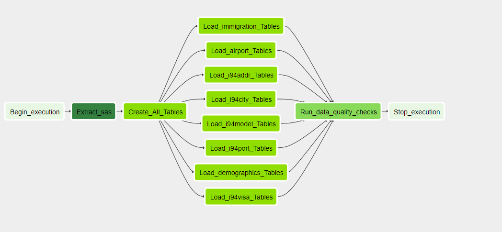
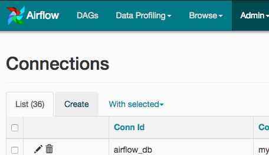

# US Tourism Behaviors Database

## Project Summary
This project focus on researching the tourism behaviors among the cities that non-immigrants visited and the cities demographics. We will process tha raw data and create relational database to store these data better.

## Pipeline
This project aims to establish a whole pipeline to create tables from raw data. Some source files was exsisted in the format of `.sas` and can not be processed directly. The whole pipeline is listed as following steps:
- upload file to s3 bucket;
- extract sas data to csv and store data in s3 bucket;
- create tables in redshift;
- copy or insert data from csv to tables;
- data quality check.

## Data Description & Sources
`I94 Immigration Data`: contains international visitor arrival statistics by world regions and select countries (including top 20), type of visa, mode of transportation, age groups, states visited (first intended address only), and the top ports of entry (for select countries).  

`U.S. City Demographic Data`: contains information about the demographics of all US cities and census-designated places with a population greater or equal to 65,000.  

`Airport Code Table`: contains the list of many airport codes in the world.  

`I94_SAS_Labels_Descriptions.SAS` file: contains various immigration codes, need to be processed and stored in S3 bucket

## Tables Description

### Fact Table 
#### immigrations

| Attribute      | Type    | Description     |
| ---------- | :-----------:  | :-----------: |
| cicid | FLOAT | CIC id | 
| i94yr | FLOAT | 4 digit year  |
| i94mon |FLOAT | Numeric month | 
| i94cit| FLOAT | City |
| i94res | FLOAT | Country code |
|  i94port | VARCHAR | Airport code |
| arrdate  | FLOAT | Arrival Date in the USA |
| i94mode  | FLOAT | Mode to access |
| i94addr  |VARCHAR | State code |
|  depdate | FLOAT | Departure Date from the USA |
|  i94bir  | FLOAT | Age |
|  i94visa | FLOAT | Vias code |
|  count  | FLOAT | Used for summary statistics |
|  dtadfile | VARCHAR |  Character Date Field - Date added to I-94 Files | 
|  visapost | VARCHAR | Department of State where where Visa was issued |
|  occup | VARCHAR |  Occupation that will be performed in U.S. |
| entdepa | VARCHAR | Arrival Flag - admitted or paroled into the U.S.|
| entdepd | VARCHAR | Departure Flag - Departed, lost I-94 or is deceased 
| entdepu  | VARCHAR | Update Flag - Either apprehended, overstayed, adjusted to perm residence |
|  matflag  | VARCHAR | Match flag - Match of arrival and departure records |
|  biryear | FLOAT | 4 digit year of birth |
|  dtaddto | VARCHAR | Date to which admitted to U.S. |
| gender | VARCHAR | Non-immigrant sex |
| insnum | VARCHAR | INS number |
| airline | VARCHAR | Airline used to arrive in U.S. | 
| admnum | FLOAT | Admission Number |
| fltno | VARCHAR | Flight number of Airline used to arrive in U.S. |
| visatype | VARCHAR  | Class of admission legally admitting the non-immigrant to temporarily stay in U.S. |

### Dimension Tables
#### airport

| Attribute      | Type    | Description     |
| ---------- | :-----------:  | :-----------: |
| ident | VARCHAR | Airport id
| type | VARCHAR | Size of airport
| name | VARCHAR | name
| elevation_ft | float | Elevation in feet
| continent | VARCHAR  | Continet
| iso_country |  VARCHAR  | Country (ISO-2)
| iso_region | VARCHAR | region (ISO-2)
| municipality | VARCHAR | Municipality
| gps_code | VARCHAR | GPS code
| iata_code | VARCHAR | IATA code
| local_code | VARCHAR | Local code
| coordinates | VARCHAR  |  Coordinates
 
 #### i94cit

 | Attribute      | Type    | Description     |
 | ---------- | :-----------:  | :-----------: |
 | code | VARCHAR  | Country code
 | reason |  VARCHAR | Country
 
 
 #### i94port

 | Attribute      | Type    | Description     |
 | ---------- | :-----------:  | :-----------: |
 | code | VARCHAR | Entry airport code
 | port| VARCHAR | Airport city and state

 
 #### i94addr

 | Attribute      | Type    | Description     |
 | ---------- | :-----------:  | :-----------: |
 | code | VARCHAR  | State code
 | address |  VARCHAR | State
 
 #### i94visa

 | Attribute      | Type    | Description     |
 | ---------- | :-----------:  | :-----------: |
 | code | VARCHAR  | Visa code
 | visa |  VARCHAR | Visa description
 
 #### i94mode

| Attribute      | Type    | Description     |
| ---------- | :-----------:  | :-----------: |
| code | VARCHAR  | Transportation code
| model |  VARCHAR | Transportation description


#### us_cities_demographics
| Attribute      | Type    | Description     |
| ---------- | :-----------:  | :-----------: |
| city         |               VARCHAR | City
| state        |              VARCHAR | State
| median_age |                FLOAT | Median of age
| male_population |            FLOAT | Number of male population
| female_Population |          FLOAT | Number of female population
| total_Population     |      FLOAT | Number of total population
| number_veterans    |        FLOAT | Number of veterans
| foreign_born     |          FLOAT | Number of foreign born 
| average_household_size |    FLOAT | Average household size
| state_code         |        VARCHAR | State Code
| race | VARCHAR | Race
| count | INT | number


 

## Data Storage

Data was stored in S3 buckets in a collection of CSV and PARQUET files. The immigration dataset extends to several million rows and thus this dataset was converted to PARQUET files to allow for easy data manipulation and processing through Dask and the ability to write to Redshift.


## DAG
The DAG created for the pipeline is:  


## Add Airflow Connections
Here, we'll use Airflow's UI to configure your AWS credentials and connection to Redshift.

1. To go to the Airflow UI:  
- You can use the Project Workspace here and click on the blue Access Airflow button in the bottom right.
- If you'd prefer to run Airflow locally, open http://localhost:8080 in Google Chrome (other browsers occasionally have issues rendering the Airflow UI).

2. Click on the Admin tab and select Connections.
  

3. Under Connections, select Create.


4. On the create connection page, enter the following values:
- Conn Id: Enter `aws_credentials`.
- Conn Type: Enter `Amazon Web Services`.
- Login: Enter your Access key ID from the IAM User credentials you downloaded earlier.
- Password: Enter your Secret access key from the IAM User credentials you downloaded earlier.

Once you've entered these values, select Save and Add Another.

5. On the next create connection page, enter the following values:
- Conn Id: Enter `redshift`.
- Conn Type: Enter `Postgres`.
- Host: Enter the `endpoint of your Redshift cluster`, excluding the port at the end. You can find this by selecting your cluster in the Clusters page of the Amazon Redshift console. See where this is located in the screenshot below. IMPORTANT: Make sure to NOT include the port at the end of the Redshift endpoint string.
- Schema: Enter `dev`. This is the Redshift database you want to connect to.
- Login: Enter `awsuser`.
- Password: Enter the password you created when launching your Redshift cluster.
- Port: Enter `5439`.

Once you've entered these values, select Save.


## Usage:
```console
# run to start airflow
airflow/start.sh
```
